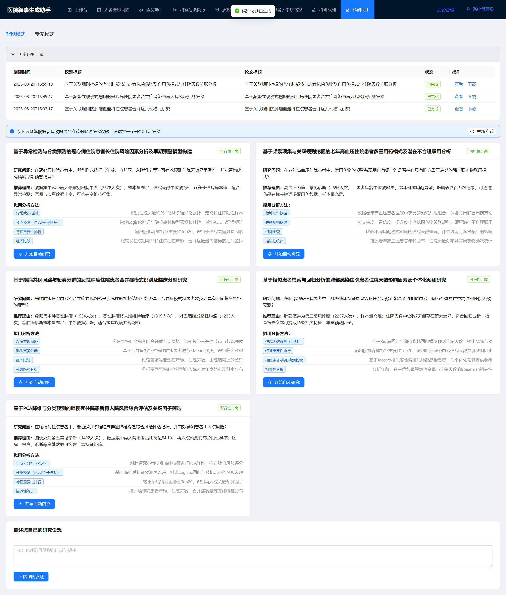
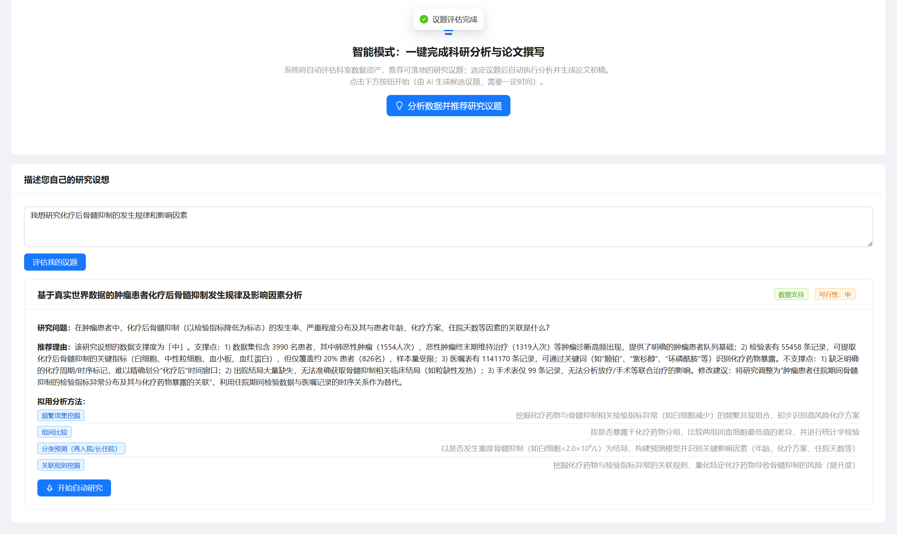
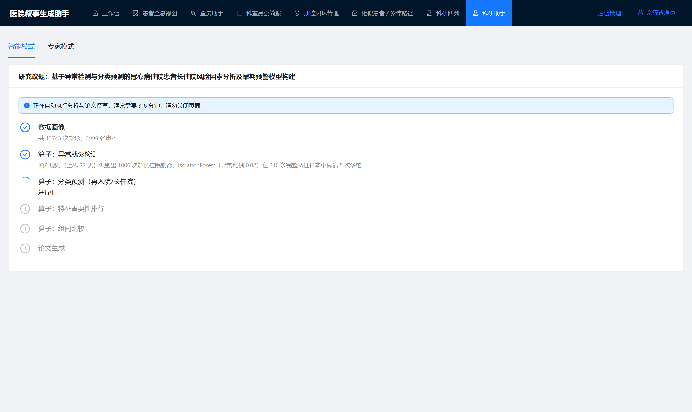
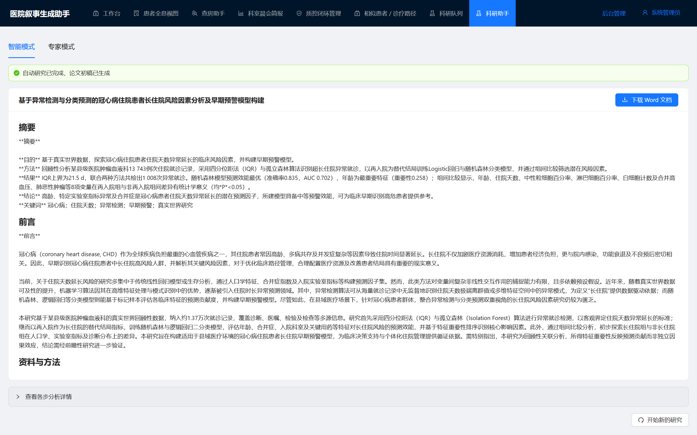
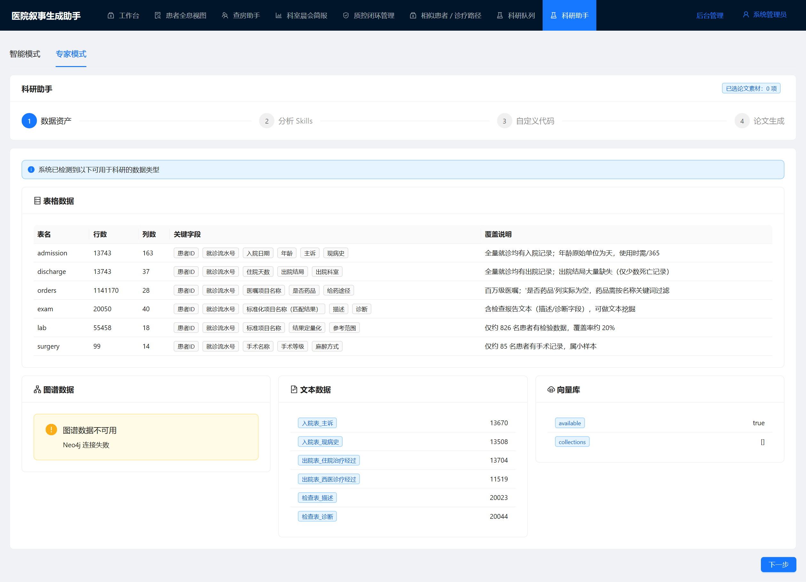
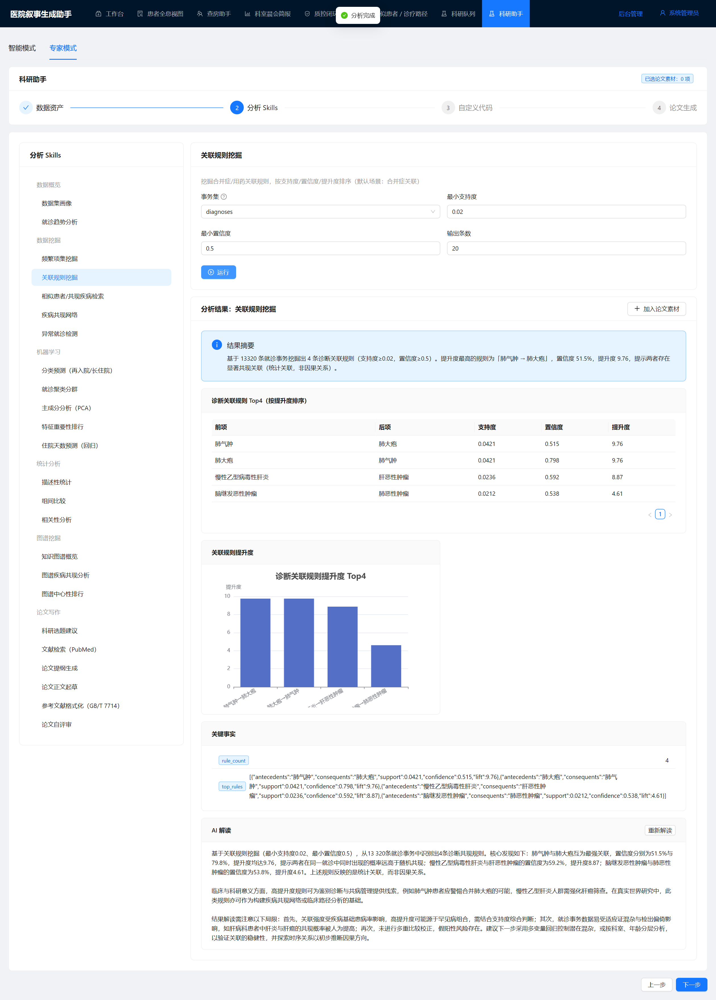
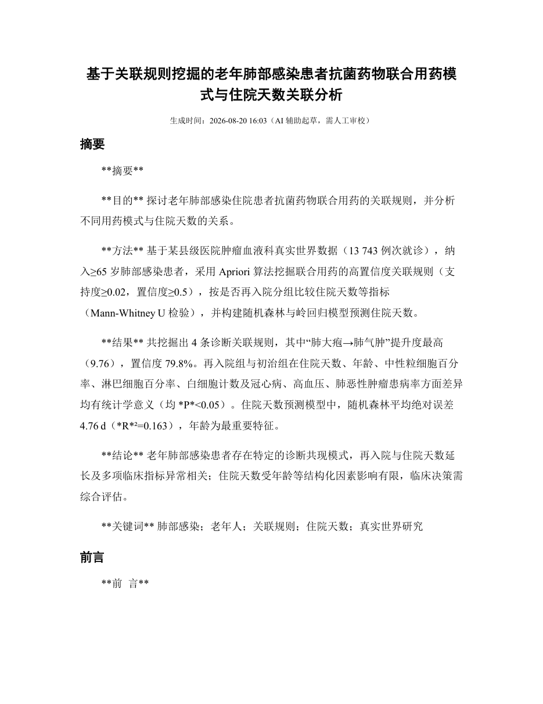

# 科研助手说明文档

> 版本：v1.0　　适用系统：医院叙事生成助手（HNA）　　更新日期：2026-08-21

## 1. 功能定位

科研助手面向**没有数据挖掘/机器学习背景的临床医生**：医生手中有数据（郸城肿瘤血液科真实世界数据：3,990 名患者、13,743 次就诊、约 114 万条医嘱、5.5 万条检验、2 万条检查及 Neo4j 知识图谱），但缺少分析手段。科研助手把数据挖掘、机器学习的关键技术封装成开箱即用的算子（Skills），并结合大模型自动完成「选题 → 分析 → 解读 → 论文撰写」的完整科研闭环。

系统提供两种使用模式：

| 模式 | 面向用户 | 使用方式 |
|---|---|---|
| **智能模式**（默认） | 不懂算法的医生 | 三步出一篇论文：推荐议题 → 一键自动研究 → 下载 Word 论文，全程无需任何参数配置 |
| **专家模式** | 有一定分析基础的用户 | 自助选择 24 个分析算子、调整参数、查看图表与 AI 解读、手动组装论文素材 |

入口：React 前端登录后，左侧菜单「科研助手」（`/portal/research-assistant`，需要 `research:view` 权限）。

---

## 2. 智能模式

### 2.1 议题推荐

进入页面后点击「**分析数据并推荐研究议题**」，系统会先对数据资产进行画像（规模、覆盖率、关键字段、高频诊断等），再由大模型结合**真实数据情况**推荐 3-5 个数据可支撑的研究议题。每个议题卡片包含：

- 论文级标题与研究问题
- 推荐理由（引用真实数据数字，如"肺恶性肿瘤 1554 人次、再入院率 84.1%"）
- 可行性标签（高 / 中 / 低）
- 拟用分析方法（系统自动匹配的算子序列及各自作用）

规则说明：

- **已研究过的议题不会重复推荐**（系统自动排除「历史研究记录」中的议题）
- 点击「重新推荐」会跳过缓存换一批不同方向的议题



### 2.2 自定义研究设想

对推荐议题不满意时，可在「**描述您自己的研究设想**」输入框中写下自己感兴趣的方向（如"化疗后骨髓抑制的发生规律"），大模型会对照真实数据资产进行评估：

- **数据支持**：给出细化后的议题标题、研究问题和分析方法序列，可直接进入自动研究
- **数据支撑不足**：明确说明缺什么数据（如"无基因组学数据、无生存终点"），并给出当前数据下最接近的可行替代方向



### 2.3 自动研究流水线

点击议题卡片上的「开始自动研究」后，系统在后台自动执行完整流水线，页面实时展示每一步进度：

1. **数据画像**——确认样本规模与数据覆盖
2. **各分析算子**——按议题方案依次执行（关联规则、共现网络、特征重要性、分类预测等，全部使用默认参数，无需调参），每个算子完成后给出一句中文结果摘要
3. **论文生成**——汇总全部分析结果，由大模型按 IMRaD 结构撰写中文论文

整个过程通常 3-6 分钟，单个步骤失败不会中断整体流程。



### 2.4 论文产出与历史记录

流水线完成后页面展示论文全文（标题、摘要、前言、资料与方法、结果、讨论、结论、参考文献），点击「**下载 Word 文档**」获得排版好的 docx（含分析图表，输出目录 `data/outputs/`）。



页面顶部的「**历史研究记录**」列出全部跑过的研究（同一议题只保留最新一次）：

- 已完成的可直接「查看」论文全文或「下载」Word，无需重跑
- 进行中的可「查看进度」，恢复实时进度视图

---

## 3. 专家模式

### 3.1 数据资产总览

第一步自动检测并展示可用于科研的数据类型：表格数据（各表行列数、关键字段、覆盖说明）、知识图谱（节点/关系统计）、文本数据（检查报告、病程记录）、向量库状态。



### 3.2 分析 Skills 工作台

第二步提供全部 24 个算子，按六大类组织（见第 4 节目录）。选择算子后按表单调整参数（均有合理默认值），点击「运行」即可获得：结果摘要 + 数据表格 + 交互图表（ECharts）+ **AI 解读**（核心发现、临床意义、注意事项、下一步建议）。满意的结果可「加入论文素材」。



### 3.3 自定义代码（实验性）

第三步允许在**受限环境**中直接执行 pandas 代码（禁止 import、文件与网络访问、30 秒超时），内置 `visits`（就诊级宽表）、`labs`、`orders` 等 DataFrame。仅供受信任用户使用。

### 3.4 论文生成

第四步手动组装素材：输入研究问题 → 可让 AI 推荐分析路径 → PubMed 文献检索（需外网）→ 勾选素材生成论文 → 预览并下载 Word。

---

## 4. 分析算子（Skills）目录

| 分类 | 算子 | 说明 |
|---|---|---|
| 数据概览 | 数据集画像 | 规模、缺失率、覆盖率、年龄/住院天数分布、诊断 Top20 |
| | 趋势分析 | 年度/月度入院趋势 |
| 数据挖掘 | 频繁项集挖掘 | Apriori，诊断/用药事务集的高频组合 |
| | 关联规则挖掘 | 支持度/置信度/提升度（合并症关联、用药模式） |
| | 相似项发现 | Jaccard 相似患者/共现疾病检索 |
| | 共现网络分析 | 疾病共现网络图 |
| | 异常检测 | IQR + IsolationForest（住院天数、检验异常） |
| 机器学习 | 分类预测 | 再入院/长住院预测（LR + 随机森林，AUC/混淆矩阵） |
| | 聚类分群 | KMeans + PCA 可视化 + 分群画像 |
| | 降维分析 | PCA 方差解释 |
| | 特征重要性 | 随机森林特征重要性 Top20 |
| | 回归预测 | 住院天数预测（Ridge + 随机森林，MAE/R²） |
| 统计分析 | 描述性统计 | 均值/中位数/标准差/分位数 |
| | 组间比较 | t 检验 / Mann-Whitney / 卡方 |
| | 相关性分析 | Pearson/Spearman + 热图 |
| 图谱挖掘 | 图谱概览 | Neo4j 节点/关系统计 |
| | 合并症共现 | 基于图谱的合并症对挖掘 |
| | 中心性分析 | 度中心性排行 |
| 论文写作 | 选题建议 | 基于数据资产的候选选题与假设 |
| | 文献检索 | PubMed 检索 + 中文要点总结（需外网） |
| | 论文提纲 | IMRaD 提纲生成 |
| | 章节写作 | 分章节论文起草 |
| | 参考文献格式化 | GB/T 7714 格式 |
| | 论文自评审 | 创新性/方法/结果/写作四维度评审 |

---

## 5. 论文产物示例

自动生成的论文为 IMRaD 结构的中文 Word 文档（题目、摘要+关键词、前言、资料与方法、结果、讨论、结论、参考文献），分析图表以图片嵌入。以下为实际生成的论文首页与正文页（对应议题「基于关联规则挖掘的老年肺部感染患者抗菌药物联合用药模式与住院天数关联分析」）：




> 说明：论文为 AI 辅助起草的初稿（文档首页有标注），其中数据结论均来自系统实际执行的分析结果，但投稿前必须由作者人工审校，并自行补齐伦理审批、参考文献核对等必要环节。

---

## 6. 技术架构

### 6.1 模块组成

```
前端  frontend/src/views/portal/ResearchAssistantView.jsx
        ├─ SmartModePanel   智能模式（议题推荐/流水线进度/历史记录/论文展示）
        └─ ExpertModePanel  专家模式（四步向导）
后端  routers/research.py                      /api/research 路由
      services/research/
        ├─ dataset_service.py          数据资产检测 + 就诊级宽表（Excel→pandas，pickle 缓存）
        ├─ skills/                     24 个算子（统一基类，返回 summary/tables/charts/facts）
        ├─ custom_code_service.py      受限代码执行（AST 白名单，禁 import/文件/网络）
        ├─ research_assistant_service.py  算子执行 + LLM 解读 + IMRaD 论文生成（python-docx）
        └─ auto_research_service.py    议题推荐 + 自定义议题评估 + 后台流水线线程 + 历史记录
存储  data/json_store/   算子结果、流水线任务（autojob_*）
      data/outputs/      论文 docx
      data/llm_cache/    LLM 响应缓存
```

### 6.2 主要 API

| 接口 | 说明 |
|---|---|
| `GET /api/research/data-assets` | 数据资产检测 |
| `GET /api/research/skills` | 算子目录（按分类） |
| `POST /api/research/skills/{id}/run` | 运行算子（含 AI 解读） |
| `POST /api/research/code/run` | 自定义代码执行（实验性） |
| `POST /api/research/auto/topics` | 议题推荐（`refresh` 换批，自动排除历史议题） |
| `POST /api/research/auto/topics/custom` | 自定义议题数据支撑性评估 |
| `POST /api/research/auto/start` | 启动自动流水线 |
| `GET /api/research/auto/{job_id}` | 流水线状态轮询 |
| `GET /api/research/auto/history` | 历史研究记录（按议题去重） |
| `POST /api/research/paper/generate` | 组装素材生成论文 |
| `GET /api/research/paper/download/{file}` | 下载论文 Word |

### 6.3 关键技术决策

- **分析在就诊级宽表上进行**（13,743 行），医嘱等百万级明细只用于构建特征，保证算子秒级响应
- **LLM 全部走缓存**（`data/llm_cache/`），相同输入重复执行秒回；议题推荐会随历史记录自动变更 prompt，缓存自然失效
- **流水线在后台线程执行**，前端 3 秒轮询进度；单步失败不中断，任务终态持久化，重启后历史可查

---

## 7. 注意事项

- **PubMed 文献检索需要外网**；内网环境下该算子会降级返回离线检索建议，不影响论文生成主流程
- **自定义代码执行为实验性功能**，虽有沙箱限制，仍建议仅对受信任用户开放
- 检验数据仅约 826 名患者（20%）有、手术仅 85 例——依赖这些字段的分析会提示样本不足，议题推荐已自动规避
- 论文为 AI 辅助初稿，**投稿前必须人工审校**；系统产出的统计结果可复现（固定算子 + 缓存），但 LLM 生成文字每次可能不同
- 如需强制全部重新分析，清空 `data/llm_cache/` 与 `data/json_store/` 中对应记录即可
